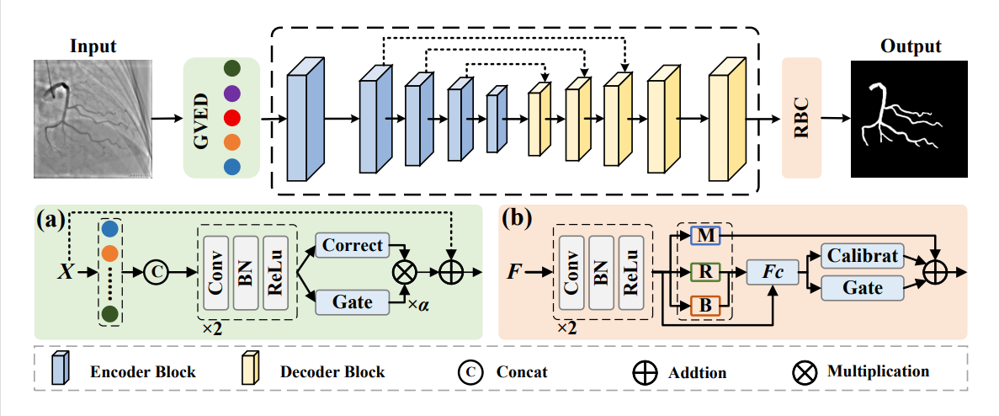

# MACFNet

## 0. Abstract

Automatic segmentation of coronary arteries from X-ray coronary
angiography (XCA) images is a crucial step in assisting diagnosis
and interventional treatment planning. Current research in this ffeld
faces challenges such as fracture problems caused by the complex
anatomy of the cardiovascular system, and the difffculty in achieving
an effective balance between global and local modeling. To address the
aforementioned issues, this paper proposes a Morphological Attention
and Context Fusion Network, named MACFNet. First, a Morphological
Attention Module (MAM) is introduced, which utilizes C-shaped and
claw-shaped morphological convolutional kernels to extract maximum
response features, effectively alleviating the fragmentation problem
at blood vessel bends and bifurcations. Second, a Context Fusion
Module (CFM) is designed, which effectively fuses contextualsemantic
information while preserving local details, ensuring a balance between
global and local modeling. Finally, to fully validate the effectiveness
of the proposed method, we conducted extensive experiments on a
private dataset (CS2026) and three public datasets (ARCADE, DCA1,
and XCAD). The Dice scores of MACFNet were at least 2.22%,
2.46%, 1.95%, and 1.52% higher than those of other related meth-ods,
respectively. The code is available at: https://github.com/
anonymous-macf/MACFNet.

## 1. Overview

<div align="center">

</div>

## 2. Main Environments

The environment installation process can be carried out as follows:

```bash
conda create -n vgcnet python=3.9 -y
conda activate vgcnet

pip install torch==1.13.0+cu117 torchvision==0.14.0+cu117 \
  --extra-index-url https://download.pytorch.org/whl/cu117

pip install numpy opencv-python albumentations pillow
pip install scikit-learn scipy scikit-image matplotlib tqdm
```

## 3. Datasets

Please organize the dataset into the following format:

```text
./data/
|-- images/
|   |-- 1.png
|   |-- 2.png
|   `-- ...
|-- masks/
|   |-- 1.png
|   |-- 2.png
|   `-- ...
|-- train.txt
|-- val.txt
`-- test/
    |-- images/
    |   |-- 1.png
    |   |-- 2.png
    |   `-- ...
    `-- masks/
        |-- 1.png
        |-- 2.png
        `-- ...
```


## 4. Train the MACFNet

```bash
python main.py 

```

## 5. Test theMACFNet

```bash
python evaluate.py 
```

The segmentation masks, visualization results, and metric file will be saved in
the results directory.

